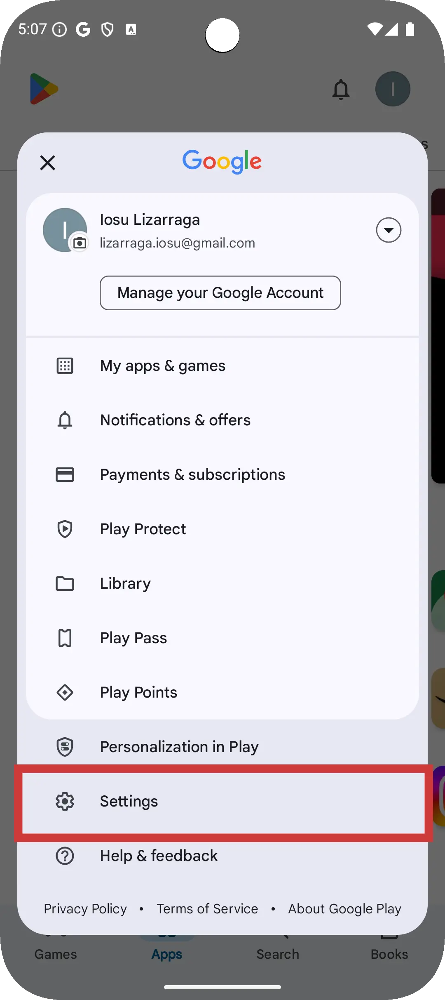
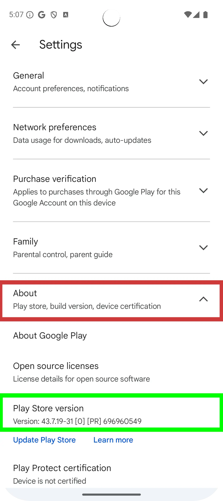
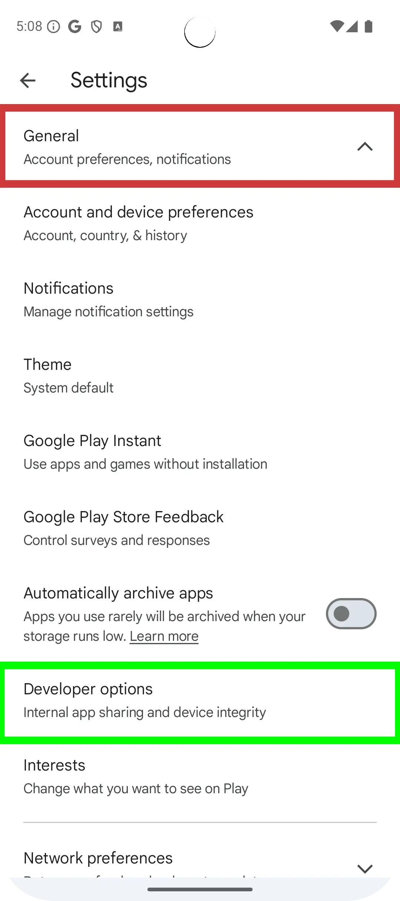
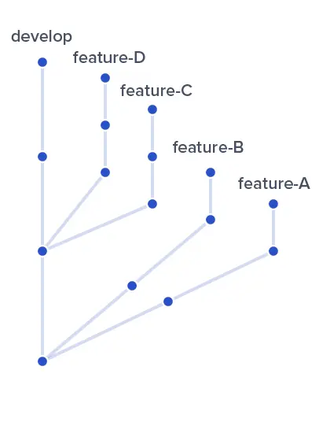
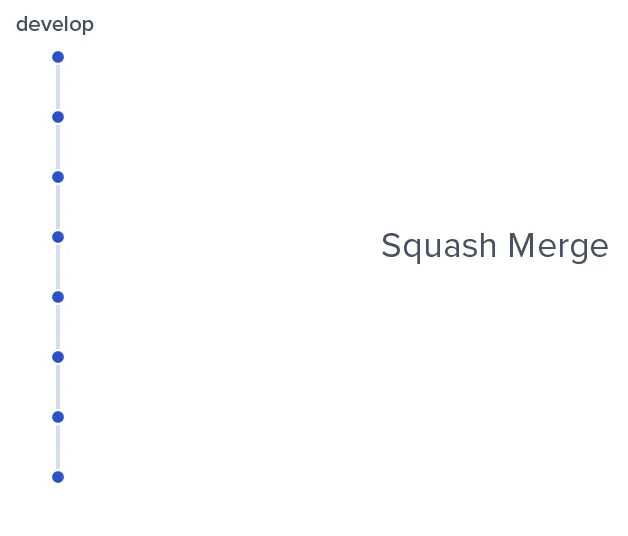

# Curriculum Vitae Web by Iosu Lizarraga Madinabeitia

## Summary

Curriculum Vitae Web is a wasmJs Compose Multiplatform project targeting Web that allows downloading the Compose Multiplatform [Curriculum Vitae App](https://github.com/ilizma/Curriculum-Vitae-App) for Android and/or iOS, differentiated by flavor to be able to have multiple CVs.

## How to install Android App

* Enable Internal app installation:
  1- Open the Play Store app.

  2- Click on the user.

  3- Click on 'Settings' item.

  4- Click on 'About' item to open more settings and click 7 times on 'Play Store version' item to activate developer options.

  5- Click on 'General' item to open more settings and click on 'Developer options' item.

  6- Click on 'Internal app sharing' switch to enable Internal app installation.

  7- Click on 'Turn on' button to confirm the Internal app installation option.

* Install the app through the web:
  - Open the received url.
  - Click on 'for Android' button.
  - Install the app from the opened Play Store screen.

## How to install iOS App

Coming soon!

## App structure description

* `/composeApp` is for code that will be shared across your Compose Multiplatform applications.
  It contains several subfolders:
  - `commonMain` is for code that’s common for all targets.
  - `wasmJsMain` is for code that’s that will be compiled for only for web target.

## App Flow

## GitFlow

 

I usually use Squash and merge for features, so that they stay as a single commit in develop, and use Merge to merge develop into master, so we have a very clean git and it's much easier to follow the flow of it.
Github allows us to restore branches that have already been Squash and merged, so we don't lose the flow of commits for that feature.

In this case, I do a Merge to get visible all the steps that I made.

### Important used libraries
- Buildkonfig: To create variants and fields.
